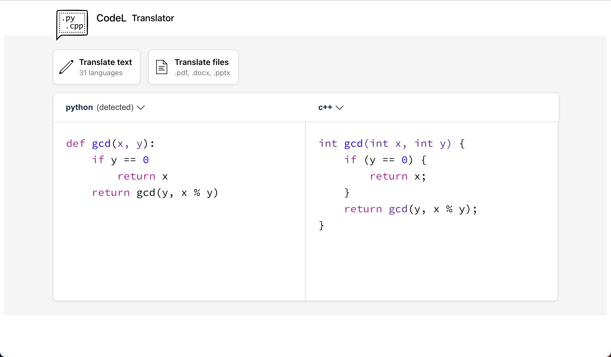

# CodeL: The World's most accuracy translator

CodeL is a translation application between programming languages using the GPT-3.5 model.

## Overview



demo: coming soon...

## Features

- Intuitive UI in tribute to DeepL
- Support for many languages

## Installation

```bash
git clone https://github.com/dike-okayama/CodeL.git && cd CodeL
```

## Usage

1. You need to get API Key from [OpenAI website](https://platform.openai.com/account/api-keys).
2. Create an .env file in the project root directory and set the API key.

```bash
echo 'REACT_APP_OPENAI_API_KEY=Your_API_key' > .env
```

> **Note**
>
> If you want to set your own environment variable names, prefix them with `REACT_APP_`. This depends on create-react-app's specification for environment variables.

3. Install the necessary packages and launch the application.

```bash
npm install && npm start
```

> **Warning**
>
> Please check the amount of API usage from [this site](https://platform.openai.com/account/usage) accordingly.

## Author

- Twitter: [@\_\_dike\_\_](https://twitter.com/__dike__)
